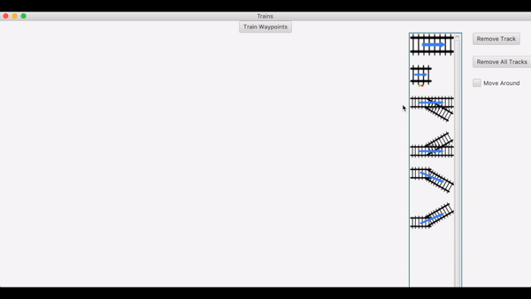

# Lionel Model Train Routing

For our senior capstone project, we were asked to create a program that would allow users to control their Lionel model trains.  We created a Java program using JavaFX for the user interface to solve this problem.  We had to interface with the Lionel Wifi Module, which required us to continually ping the Wifi Module as well as interpret which hex codes to send in order to control the trains.

## Track Layout

We needed to have a way for the user to input their track layout.  The solution that we came up with was a drag-and-drop solution where the user could select a track from the pane on the right-hand side of the screen, and then drag it over to the main canvas.  When two track pieces got close together, we would snap them together to signify that the program recognized that they were connected.

To the very far right of the screen, there are buttons that let the user remove the selected track, remove all tracks, and drag the mouse on the background to move around the canvas, respectively.

## Train Waypoints

The train waypoints screen allows the users to add different waypoints for different trains.  In the example shown, the train has three waypoints, and so it will go from waypoint 1 to waypoint 2, from waypoint 2 to waypoint 3, and then finally from waypoint 3 back to waypoint 1.  Once the train has returned to the first waypoint, it will continue to repeat the path until told to stop.

## Sensor and Switch Matching

Next is the sensor matching screen.  The program knows that the track has sensors, but it does not know which one is which, and so the user must match them up. The list of buttons on the right is generated by querying the Wifi Module to see which sensors are connected to the Module.  When a button is clicked, it will physcially light up the sensor on the track.  The user then clicks the corresponding track in the program to tell the program that that track should be matched to that button.

## Run

Finally, the running screen.  The user places the train behind the first waypoint, and clicks start.  The train will then run according to the specified waypoints.

